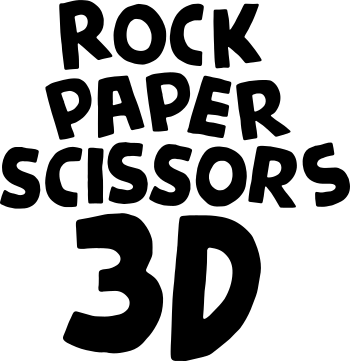

**The classic game of rock, paper, scissors in 3D!**

## Description

## Technologies

The core technologies used are JavaScript and WebGL. The following libraries and tools are used:

| Name              | License | Description                                  |
| ----------------- | :-----: | -------------------------------------------- |
| React             |   MIT   | Component-based, front-end interface library |
| Three.js          |   MIT   | 3D graphics API for the web, based on WebGL  |
| React Three Fiber |   MIT   | A React renderer for Three.js                |
| Drei              |   MIT   | Useful helpers for React Three Fiber         |
| Leva              |   MIT   | React-first GUI control panel component      |
| Zustand           |   MIT   | State management                             |
| Vite              |   MIT   | Frontend development tooling                 |

## Assets

All the assets used (3D models, images etc.) are either using Creative Commons / Public Domain or they were created by me.

## Software Used

A non-exhaustive list of all the software that was used during the development of OKTOWORLD.

- Visual Studio Code
- Figma
- Blender
- Adobe Photoshop
- Inkscape
- Google Chrome
- Microsoft Edge
- Mozilla Firefox

## License

Copyright (c) 2023 Michael Kolesidis 
Licensed under the [GNU Affero General Public License v3.0](https://www.gnu.org/licenses/agpl-3.0.html).
