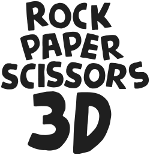
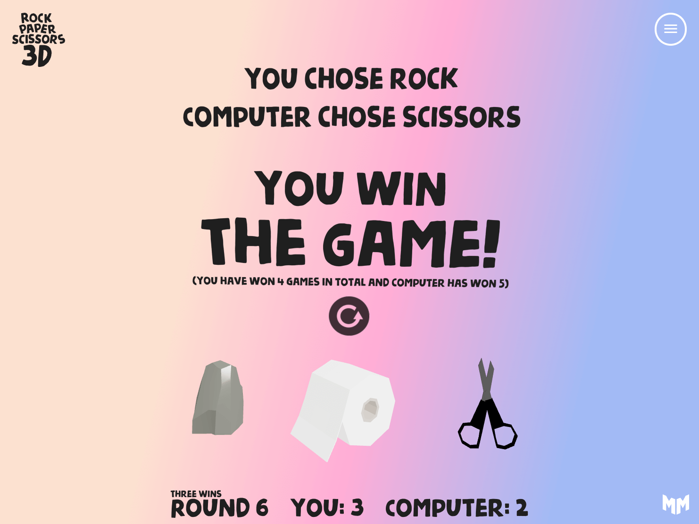
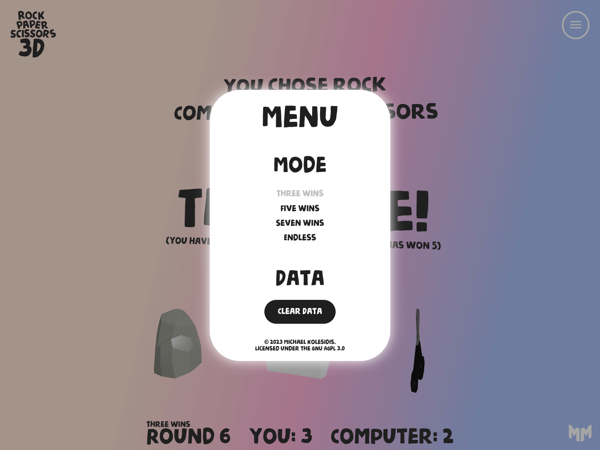

**The classic game of rock, paper, scissors in 3D!**

## Features

A non-exhaustive list of features:

- Full 3D environment
- Animated objects (rock, paper, scissors)
- Orbit controls
- Responsive design (desktop + mobile)
- Four game modes (three wins, five wins, seven wins, and endless)
- Three game phases (ready, playing, ended)
- State management
- Current game saved in local storage
- Preferences saved in local storage (ex. mode)
- Total wins saved in local storage
- Clear data option
- Menu with options

## Technologies

The core technologies used are _JavaScript_ and _WebGL_. The following libraries and tools are used:

| Name              | License | Description                                  |
| ----------------- | :-----: | -------------------------------------------- |
| React             |   MIT   | Component-based, front-end interface library |
| Three.js          |   MIT   | 3D graphics API for the web, based on WebGL  |
| React Three Fiber |   MIT   | A React renderer for Three.js                |
| Drei              |   MIT   | Useful helpers for React Three Fiber         |
| Zustand           |   MIT   | State management                             |
| Vite              |   MIT   | Frontend development tooling                 |

## Screenshots

## Roadmap

- Smoother animations (modal, hovering etc.)

## Assets

All the assets used (3D models, images etc.) are either using Creative Commons / Public Domain or they were created by me.

## Software Used

A non-exhaustive list of all the software that was used during the development of _Rock Paper Scissors 3D_.

- Visual Studio Code
- Figma
- Blender
- Adobe Photoshop
- Inkscape
- Google Chrome
- Microsoft Edge
- Mozilla Firefox

## Gameplay and Rules

Rock Paper Scissors is a hand game played between two people where each player simultaneously forms one of three shapes with their hand: a closed fist (representing a rock), an open hand (representing paper), or a hand with the index and middle fingers extended (representing scissors).

In this 3D version of the game, the player has to pick one of the options by clicking on the respective object. Upon clicking, the computer makes its choice, and the result of the round can be seen immediately on screen.

The winner of the game is determined by a set of rules: rock crushes scissors, scissors cuts paper, and paper covers rock. If both players choose the same shape, the game is tied and played again.

## License

Copyright (c) 2023 Michael Kolesidis 
Licensed under the [GNU Affero General Public License v3.0](https://www.gnu.org/licenses/agpl-3.0.html).
